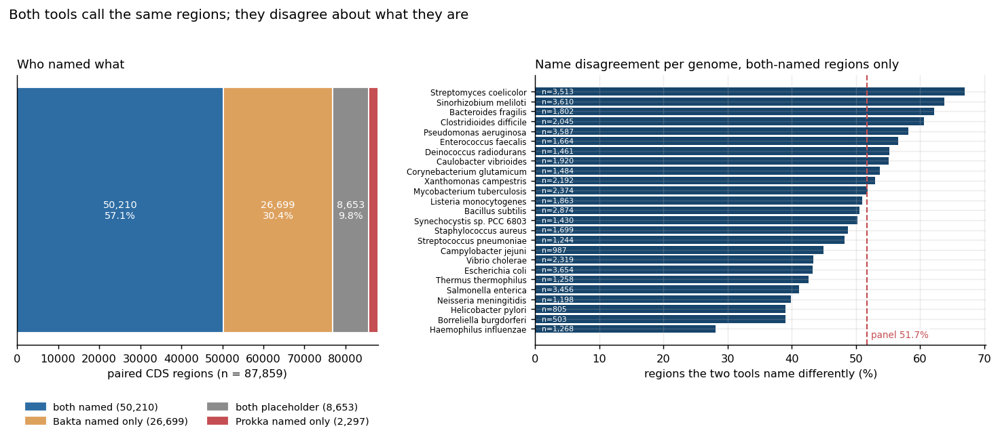
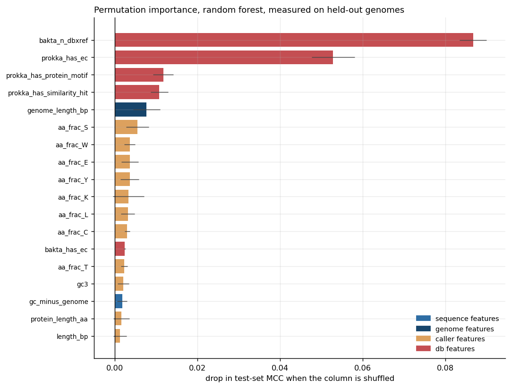
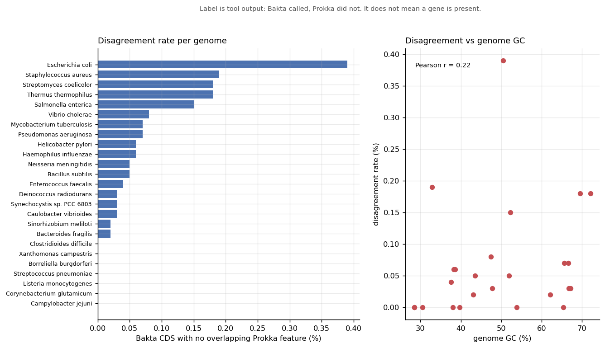
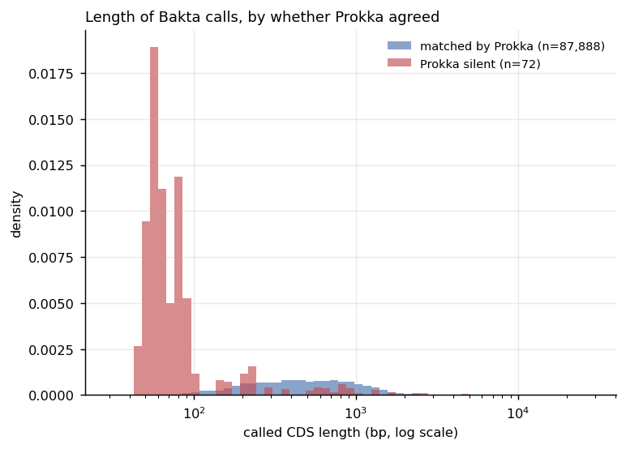
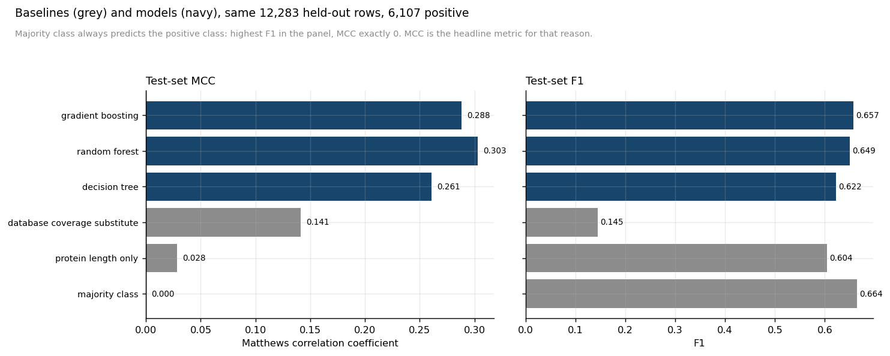
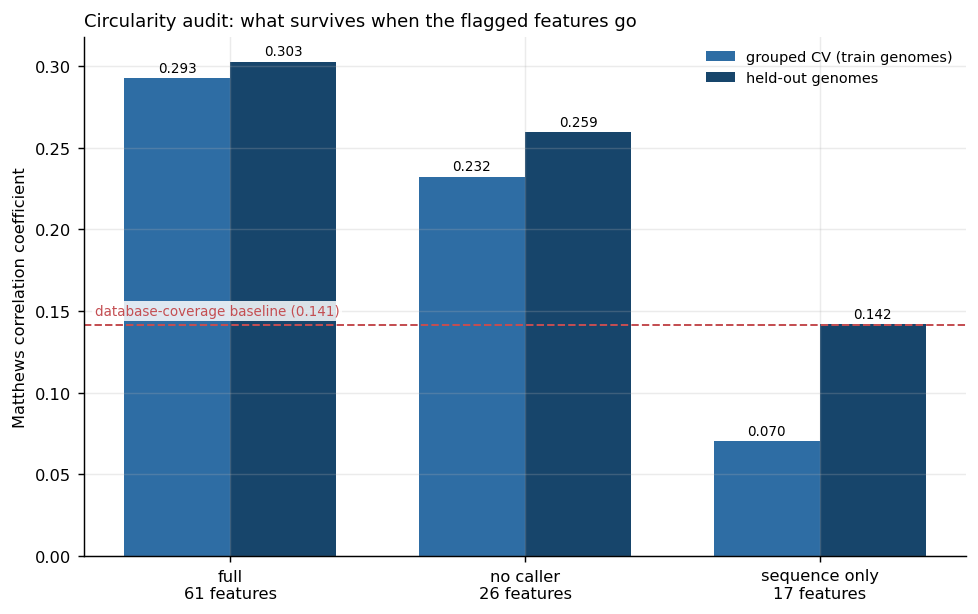
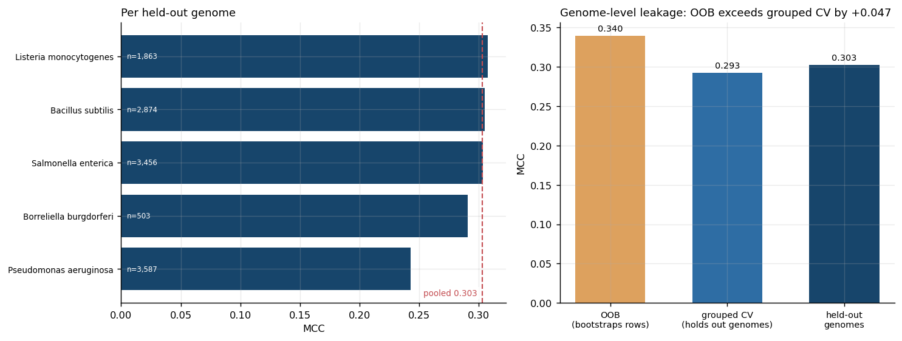

# bakta_prokka_disagreement_prediction

Machine Learning for Biology | Chapter 3.

Two experiments on one panel of 25 complete bacterial genomes (95.2 Mbp,
8 phyla, GC 28.45–72.12%), annotated once with Bakta and once with Prokka.

---

## The headline

**Bakta and Prokka give the same coding region a different product name about
half the time.**

Of 87,859 CDS regions both tools called, 50,210 were given a non-placeholder
product name by both. (A further 101 Bakta CDS have no same-strand Prokka CDS
to compare against at all — those are part one's label, not part two's.) The two tools disagree about that name on **25,977 of
them — 51.7%**.

That number needs no model to matter. Product names are what pangenome
analyses, functional enrichment tests and AMR reports are built on, and two
standard tools reading identical DNA return different names for half of it.

The obvious objection is that Bakta has naming conventions which cannot match
Prokka by construction — `… domain-containing protein`, `Uncharacterized
protein <ORF-name>`, and names carrying a DUF number. Those were declared
before any model was fitted. They are **4,494 regions (9.0%) and they disagree
99.9% of the time**. Excluding them:

| set | n | name disagreement |
|---|---:|---:|
| all both-named regions | 50,210 | **51.7%** |
| excluding three Bakta fallback-naming conventions | 45,716 | **47.0%** |
| those three conventions alone | 4,494 | 99.9% |

Both numbers are published together. The finding survives the objection.

Counting those conventions needed care: matched independently they total 4,650
rows, but every one of the 156 DUF names also ends in `domain-containing
protein`, so the sum double-counts. 4,494 is the distinct union.

*Left: which tool named what, across all 87,859 paired CDS regions. The blue
block is the primary analysis set. Right: name-disagreement rate for each of
the 25 genomes, with the panel-wide 51.7% marked. No single genome carries the
result — the spread runs from 28.1% to 66.9%, and every genome is well above
zero.*

Under the two declared sensitivity checks the rate moves from 56.0%
(28,121 regions; strict — case-folding and whitespace only) to 50.6%
(25,418 regions; loose — generic tokens dropped, compared as unordered token
sets). That is a spread of 5.4 points across the full declared range. The
disagreement is substantive, not typographic.

## The question, and the answer

Given a region both tools called, can sequence predict whether they will name
it differently?

**Largely no.** A random forest reaches MCC 0.303 on five held-out genomes
against a majority-class floor of 0.000, but the audit shows what it is
reading. With every database-derived and caller-derived feature removed, the
sequence-only arm falls to a grouped-CV MCC of 0.070. Summed permutation
importance across 61 features: **database-derived 0.165 across 9 features,
caller-derived 0.019 across 35, sequence and genome features −0.001 across
17** (a magnitude of 0.001, and negative).

*Permutation importance measured on the held-out genomes, in MCC. The two bars
that matter are red — database-derived. The twenty amino-acid fractions and
the sequence features sit near zero. Impurity importance ranks these
differently and is reported alongside in the metrics file; the permutation
column is the one to read.*

The three strongest features are `bakta_n_dbxref`, `prokka_has_ec` and
`prokka_has_protein_motif`. The model is reading database-search output, not
DNA. That is reported as the result rather than presented as a sequence model.

## What the label is, and is not

The label is **disagreement between two software products about a name**. It
is not a claim that either name is correct, and it is not a claim about what
any protein does. Columns are named `name_disagreement`, `product_bakta`,
`product_prokka` for that reason. Establishing which name is right would
require evidence this repository does not contain.

## The db-light constraint, and which way it pushes

Bakta ran against **db-light**, not db-full: this machine had ~13 GB free and
db-full does not fit. That is recorded as a result-affecting constraint in
`results/metrics/02_annotation_versions.json`.

The primary analysis is **conditional on both tools having named the region**.
That restriction is imposed by what is measurable — two names cannot be
compared when one tool produced none — and not chosen for convenience.

| cell | n | share of paired regions |
|---|---:|---:|
| both named (the primary analysis set) | 50,210 | 57.1% |
| Bakta named only | 26,699 | 30.4% |
| both placeholder | 8,653 | 9.8% |
| Prokka named only | 2,297 | 2.6% |

Two consequences, both stated rather than assumed away:

**The naming asymmetry is not a db-light artefact.** The large asymmetric cell
is *Bakta named, Prokka did not*, not the reverse. Bakta on db-light leaves
12.5% of paired CDS as a placeholder against Prokka's 40.2%. db-light can only
make Bakta name *fewer* regions than db-full would, so it works against this
asymmetry rather than producing it. 26,699 is a lower bound.

**51.7% is plausibly an underestimate.** Under db-full the primary set would
grow, and the regions added would be exactly those Bakta currently cannot
name — thin-evidence cases, which is where disagreement concentrates. The
composition of the primary set is db-light-dependent even though its
definition dodges the asymmetry.

## The mechanism is two mechanisms, pulling opposite ways

The natural reading of the importance ranking is a single causal chain: weak
reference coverage → Bakta falls back on a structural name → Prokka names it
differently → disagreement. Tested rather than asserted
(`22_content_mechanism.json`), that chain holds in one place and **reverses in
another**.

On Prokka's side it holds: within the 45,716 remainder regions, disagreement
is 54.0% without an EC number against 42.1% with one.

On Bakta's side it inverts. Disagreement *rises* with Bakta's cross-reference
count — 44.2% at the minimum two, **79.8% at three**, 62.8% at four or more. A
third cross-reference is typically an EC number, a BlastRules hit or a
virulence-factor match, and it comes with a *more specific* Bakta name, which
is then more likely to differ from Prokka's more generic one.

`bakta_n_dbxref` is the forest's strongest single feature because extra Bakta
evidence predicts a more specific name that Prokka does not match — not
because thin evidence predicts a fallback name.

## Part one: the interval experiment, and why it failed

The original question was whether *interval* disagreement — one tool calling a
CDS where the other leaves the region empty — is predictable from sequence.
It is not answerable with this tool pair.

87,960 Bakta CDS calls. **72** have no overlapping Prokka feature: a positive
rate of 0.0008. Among 87,888 matched calls, **87,788 share byte-identical
start and stop coordinates**.

*Part one's label. The y-axis tops out below 0.4% — for most genomes the two
tools produce no interval disagreement at all. There is no signal here to
model.*

The reason is architectural. Both tools delegate CDS calling to the same
algorithm — Pyrodigal is a Cython reimplementation of Prodigal — so the
comparison largely asked whether Prodigal agrees with itself. It does. Of the
72 positives, 34 come from Bakta's sORF module, which Prokka has no equivalent
of.

The held-out set contained **13** positives. The forest reached average
precision 0.589 against a no-skill floor of 0.00069, and 0.470 with the caller
features removed — but on 13 positives those are not point estimates, and
`lib_model.evaluate` attaches a reliability warning to any metrics file
computed on fewer than 30.

*The 72 positives are almost all short. Prodigal's default minimum gene length
is 90 bp and Bakta's sORF module looks below it, so the label is largely a
readout of which tool runs an extra module — not of anything in the DNA.*

That negative result stands and is published in full as steps 01–11. It is
also what motivated part two: the tools agree on *where* genes are and
disagree on *what they are*.

## Decisions fixed before any result was seen

Written into the code and this file before the first model was fitted, and not
revised afterwards.

- **Placeholder strings** are matched as an enumerated list of exact literals
  after case-folding, never by substring. `hypothetical` occurs inside 12
  distinct Bakta products of which 11 are real names; `conserved` inside 37.
  The full list and its counts are in `13_name_rules.json`.
- **Name normalisation**: NFKC → strip trailing bracketed qualifiers → strip
  one trailing gene-symbol token → strip leading hedges → case-fold →
  punctuation to whitespace. The gene-symbol strip is **pair-symmetric**; a
  per-record version scored `GTPase Era` against `GTPase Era` as a
  disagreement 23 times. `lib_names.assert_symmetric` fails the run if
  identical raw strings are ever scored as different.
- **Sensitivity checks** (strict, loose) were named in advance, as checks and
  not as alternatives to switch to.
- **EC numbers and gene symbols** are separate reported columns, never
  features — either would be a second measurement of the label. Gene symbols
  differ on 41.1% of comparable regions, EC numbers on 16.7%.
- **The split** is grouped by genome, five held out, asserted disjoint at run
  time.
- **Hyperparameters**: mean MCC across five genome-grouped folds, then the
  one-standard-error rule to the simplest model. Grids declared before the
  first fit.
- **Feature provenance**: all 61 features carry two flags, 35 caller-derived,
  9 db-derived, 17 neither. Step 19 reads them from the manifest; no feature
  list is hard-coded downstream.

## Results at a glance

Test set: 12,283 regions from five held-out genomes, 6,107 positive.

| | test MCC | accuracy | F1 |
|---|---:|---:|---:|
| majority class | 0.000 | 0.497 | 0.664 |
| protein length, one threshold | 0.028 | 0.511 | 0.604 |
| database coverage | 0.141 | 0.533 | 0.145 |
| decision tree | 0.261 | 0.630 | 0.622 |
| **random forest** | **0.303** | 0.651 | 0.649 |
| gradient boosting | 0.288 | 0.643 | 0.657 |

The majority-class baseline scores 0.497 accuracy, not 0.503, because the
majority class of the training genomes is *positive* (52.4%) while the
held-out genomes are 49.7% positive — predicting the training majority lands
just below a coin flip. That is the floor, and it is why MCC rather than
accuracy is the headline metric.

*Baselines in grey, models in navy, all scored on the same 12,283 held-out
regions. Note the F1 panel: the majority-class baseline scores 0.664 F1 while
its MCC is 0.000. On a near-balanced problem F1 flatters a predictor that has
learned nothing, which is why MCC leads every table here.*

Circularity audit, same held-out genomes:

| arm | features | grouped CV MCC | test MCC |
|---|---:|---:|---:|
| full | 61 | 0.293 | 0.303 |
| caller-derived removed | 26 | 0.232 | 0.259 |
| **sequence only** | 17 | **0.070** | **0.142** |

*What survives as the flagged features are removed. The sequence-only arm
falls to a grouped-CV MCC of 0.070 — below the database-coverage baseline
drawn in red. The gap between the two bars in each pair is the difference
between holding out genomes during selection and holding them out entirely.*

Forest OOB MCC is 0.340 against a grouped-CV mean of 0.293. That gap of
**0.047** is a measurement of genome-level leakage, not a discrepancy to
explain away: OOB bootstraps rows, so a held-out row is scored by trees that
saw its neighbours from the same genome and the same annotation run.

*Left: the forest scores consistently across all five held-out genomes, so the
pooled number is not driven by one of them. Right: the same forest measured
three ways. OOB is optimistic because it resamples rows rather than genomes,
and the 0.047 gap is the size of that optimism.*

One specified baseline, *is either product hypothetical*, is **degenerate by
construction** — the primary set is defined as both tools having named the
region, so it is constant. It is reported as uncomputable rather than quietly
replaced; the database-coverage row above is labelled as its substitute.

## Provenance

Annotation depends on database release as much as on tool version. Both are
recorded in `provenance/`. Bakta db-light v6.0 (2025-02-24, DOI
`10.5281/zenodo.14916843`). The same genome annotated against a newer database
will produce different calls.

The database itself is not in this repository — it is 4.0 GB and
`provenance/fetch_bakta_db.sh` re-downloads the pinned release.

## Structure

    data/          genomes and annotation output (gitignored)
    scripts/       numbered pipeline
    results/       metrics as numbered JSON, one file per step
    figures/       PNG and PDF
    provenance/    tool versions, database versions, checksums
    notes/         lab notebook and run logs (published)

Steps 01–11 are the interval experiment; 12–22 are the content experiment.

## Reproducing

    conda env create -f environment.yml
    conda activate bpdp
    bash scripts/00_run_all.sh          # everything, from an empty checkout

    bash scripts/run_content_only.sh    # part two only, on annotation already on disk

Part two runs in dependency order rather than numeric order: step 22 computes
numbers step 20 quotes.

Seed 42. Every number in this file maps to a file in `results/metrics/`, and
`scripts/verify_readme_numbers.py` checks each one and exits non-zero on the
first disagreement. Nothing here was transcribed from a terminal.

## References

Tools, databases and methods this project depends on. Versions are the ones
actually run, recorded in `provenance/tool_versions.txt`.

**The two annotators compared**

1. Schwengers O, Jelonek L, Dieckmann MA, Beyvers S, Blom J, Goesmann A.
   Bakta: rapid and standardized annotation of bacterial genomes via
   alignment-free sequence identification. *Microbial Genomics*.
   2021;7(11):000685. [doi:10.1099/mgen.0.000685](https://doi.org/10.1099/mgen.0.000685)
   — v1.12.0, database db-light v6.0.
2. Seemann T. Prokka: rapid prokaryotic genome annotation. *Bioinformatics*.
   2014;30(14):2068–2069.
   [doi:10.1093/bioinformatics/btu153](https://doi.org/10.1093/bioinformatics/btu153)
   — v1.15.6.

**The gene caller they share — the reason part one had nothing to model**

3. Hyatt D, Chen G-L, LoCascio PF, Land ML, Larimer FW, Hauser LJ. Prodigal:
   prokaryotic gene recognition and translation initiation site
   identification. *BMC Bioinformatics*. 2010;11:119.
   [doi:10.1186/1471-2105-11-119](https://doi.org/10.1186/1471-2105-11-119)
   — called by Prokka as v2.6.
4. Larralde M. Pyrodigal: Python bindings and interface to Prodigal, an
   efficient method for gene prediction in prokaryotes. *Journal of Open
   Source Software*. 2022;7(72):4296.
   [doi:10.21105/joss.04296](https://doi.org/10.21105/joss.04296)
   — called by Bakta; a Cython reimplementation of ref. 3, which is why the
   two tools agree on 87,788 of 87,888 matched intervals.

**The reference sets that drive the naming disagreement**

5. Suzek BE, Wang Y, Huang H, McGarvey PB, Wu CH, UniProt Consortium. UniRef
   clusters: a comprehensive and scalable alternative for improving sequence
   similarity searches. *Bioinformatics*. 2015;31(6):926–932.
   [doi:10.1093/bioinformatics/btu739](https://doi.org/10.1093/bioinformatics/btu739)
   — the source of most Bakta product names here, and of `bakta_n_dbxref`,
   the strongest single feature in the model.
6. Mistry J, Chuguransky S, Williams L, Qureshi M, Salazar GA, Sonnhammer ELL,
   Tosatto SCE, Paladin L, Raj S, Richardson LJ, Finn RD, Bateman A. Pfam: the
   protein families database in 2021. *Nucleic Acids Research*.
   2021;49(D1):D412–D419.
   [doi:10.1093/nar/gkaa913](https://doi.org/10.1093/nar/gkaa913)
   — the origin of the `… domain-containing protein` fallback names, and of
   `bakta_has_pfam`, which is constant across the primary analysis set.

**Methods**

7. Breiman L. Random forests. *Machine Learning*. 2001;45(1):5–32.
   [doi:10.1023/A:1010933404324](https://doi.org/10.1023/A:1010933404324)
   — including the out-of-bag estimate, reported here against grouped
   cross-validation to size genome-level leakage rather than to replace it.
8. Pedregosa F, Varoquaux G, Gramfort A, Michel V, Thirion B, Grisel O,
   Blondel M, Prettenhofer P, Weiss R, Dubourg V, Vanderplas J, Passos A,
   Cournapeau D, Brucher M, Perrot M, Duchesnay É. Scikit-learn: machine
   learning in Python. *Journal of Machine Learning Research*.
   2011;12:2825–2830. <https://www.jmlr.org/papers/v12/pedregosa11a.html>
   — v1.7.2.
9. Chicco D, Jurman G. The advantages of the Matthews correlation coefficient
   (MCC) over F1 score and accuracy in binary classification evaluation.
   *BMC Genomics*. 2020;21:6.
   [doi:10.1186/s12864-019-6413-7](https://doi.org/10.1186/s12864-019-6413-7)
   — why MCC leads every table here. The majority-class baseline in this
   repository scores 0.664 F1 at 0.000 MCC, which is the paper's point made
   on real output.

**Why annotation disagreement is worth measuring**

10. Schnoes AM, Brown SD, Dodevski I, Babbitt PC. Annotation error in public
    databases: misannotation of molecular function in enzyme superfamilies.
    *PLoS Computational Biology*. 2009;5(12):e1000605.
    [doi:10.1371/journal.pcbi.1000605](https://doi.org/10.1371/journal.pcbi.1000605)
11. Salzberg SL. Next-generation genome annotation: we still struggle to get
    it right. *Genome Biology*. 2019;20:92.
    [doi:10.1186/s13059-019-1715-2](https://doi.org/10.1186/s13059-019-1715-2)

Every reference above was resolved against Crossref before being listed.
Neither ref. 10 nor ref. 11 is evidence about which of the two tools is right
in any particular case — this repository does not measure that.

## Licence

MIT — see `LICENSE`. That covers the code, the metrics files and the figures
in this repository.

It does not cover the input genomes, which are not distributed here: they are
fetched from NCBI RefSeq by `scripts/01_fetch_genomes.py` against the
accessions pinned in `data/accessions.tsv`. Bakta and Prokka, and the
reference databases they search, carry their own licences.
